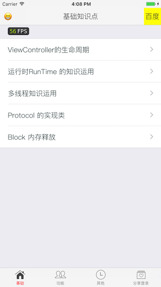
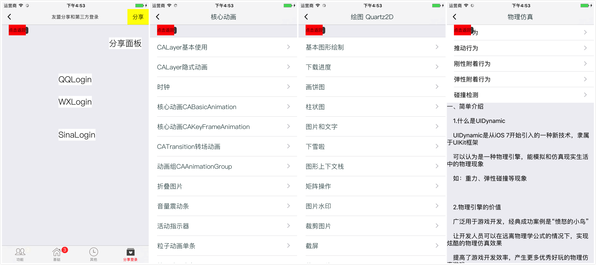
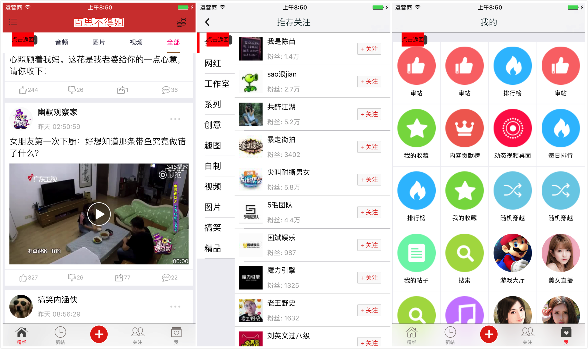
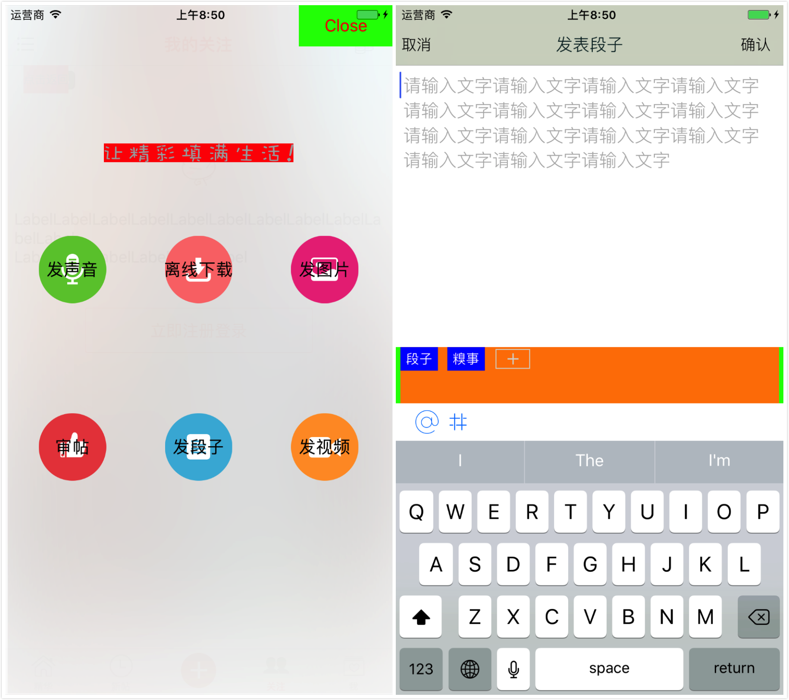
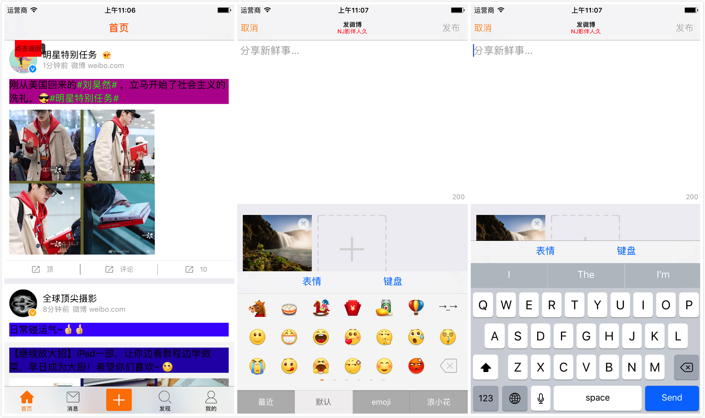
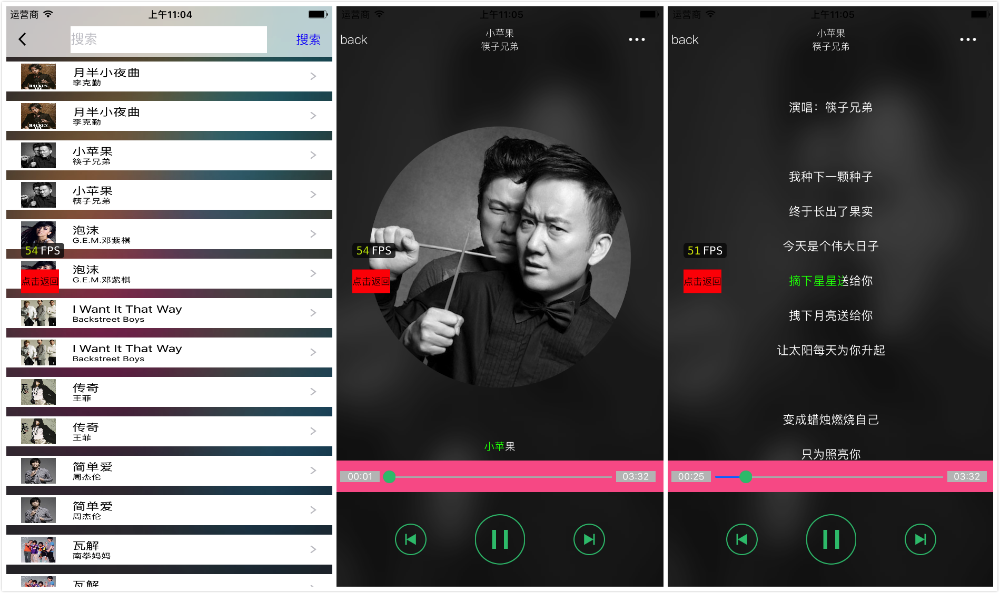
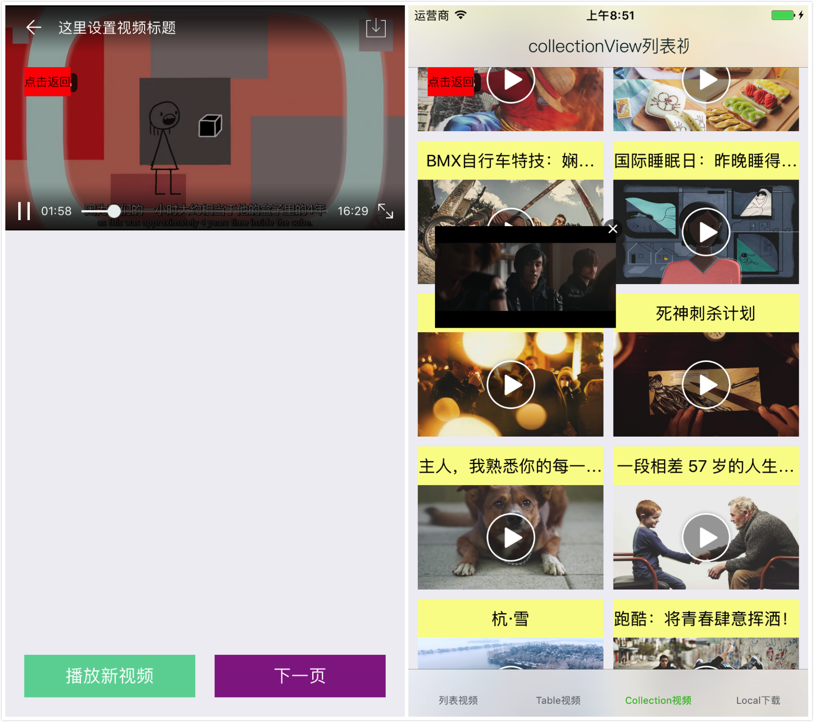
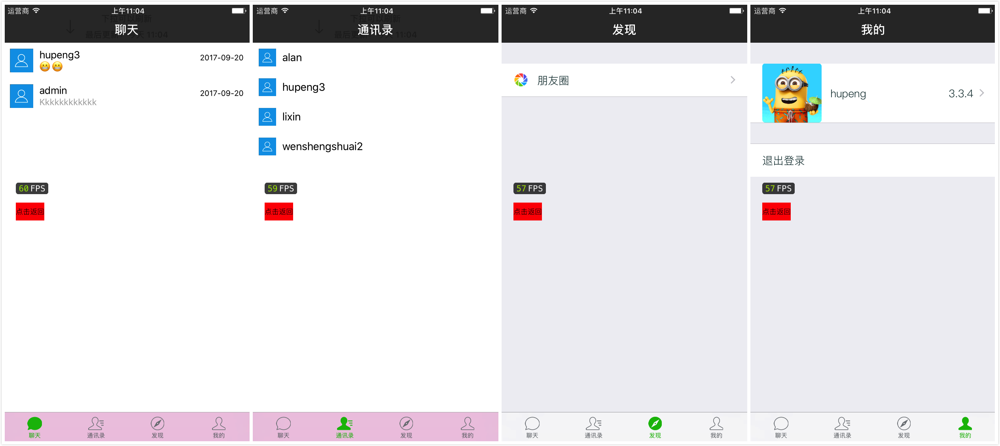

# 各种功能 Demo

- demo, 百思不得姐, 新浪微博, sina,QQ音乐, QQMusic, music, 视频列表, 滚动播放, 拖拽播放, 离线下载, 即时通讯, 打印 ios 日志,省市区三级联动,没有导航栏, 自定义导航栏,字体适配屏幕,空白页展示,空白页,导航条颜色渐变,导航条高度渐变, YYText 使用,列表的展开和收起,京东首页布局,流水布局, 垂直流水布局, 水平流水布局, 非规则流水布局, 键盘处理,文件下载, Masonry 案例,LKDB 数据库,百度地图,二维码,照片上传, 照片上传有进度,列表倒计时, H5和原生交互,自定义各种弹框,常见表单类型,人脸识别,列表加载图片,列表拖拽,日历操作,导航条渐变,指纹解锁,物理仿真,控制器生命周期, RunTime 的应用,多线程, Protocol 实现, Block 内存释放, 自定义启动界面, 欢迎界面, 欢迎视图,第三方登录, 第三方分享, 微信, 环信, 即时通讯, 网络视频播放, 网络音乐播放, 推送, 跳转, 自定义导航栏, 不用系统的, 表情键盘, 自定义键盘

- 综合项目
PLMMPRJK/PLMMPRJK/Classes/IM_HX/EasyMobSDKS/HyphenateFullSDK/Hyphenate.framework/Hyphenate.a 文件过大, 请下载[环信即时通讯SDK](http://downloads.easemob.com/downloads/ios-easemob-sdk_2.3.3.zip) 添加

---

 

## 百思不得姐
 

## 新浪微博

## QQ音乐

## 视频列表
 

## 即时通讯

