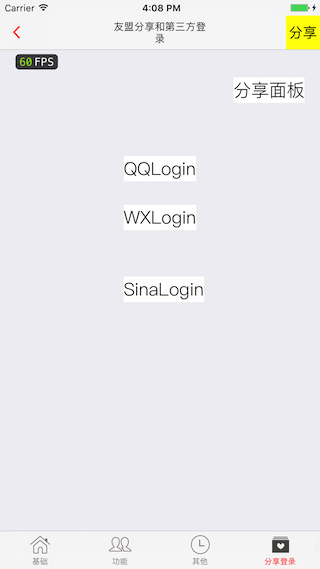
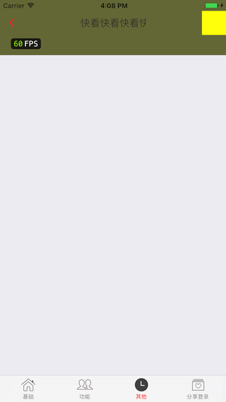

# 各种功能 Demo

### 感谢作者[wujunyang](https://github.com/wujunyang)在 GitHub 上[MobileProject](https://github.com/wujunyang/MobileProject)开源项目

### [PLMMPrjk](https://github.com/NJHu/PLMMPrjk)开源项目大部分代码直接借鉴[MobileProject](https://github.com/wujunyang/MobileProject)学习.

### 感谢作者[wujunyang](https://github.com/wujunyang)在 GitHub上细心解答.

## 已经完成的

- 导航条自定义
- 启动导引, 启动广告
- 友盟第三方登录, 友盟分享, 友盟推送
- 基础知识点

