

<b>Github&nbsp点个赞↑👍,感谢您的支持!</b>

GitHub：[NJHu](https://github.com/njhu) ｜ Blog：[NJHu 微博(Chinese)](https://www.weibo.com/njhu) ｜ [feedback](mailto:64hp@163.com):64hp@163.com

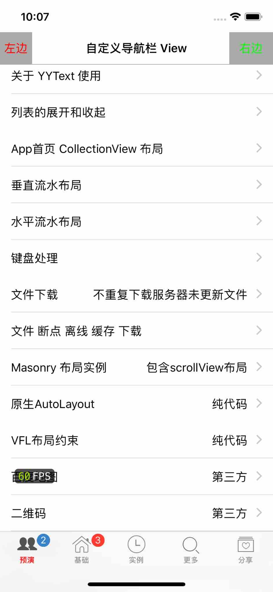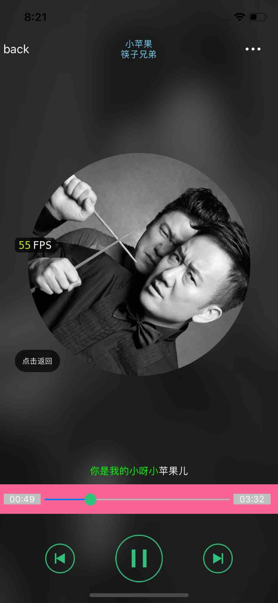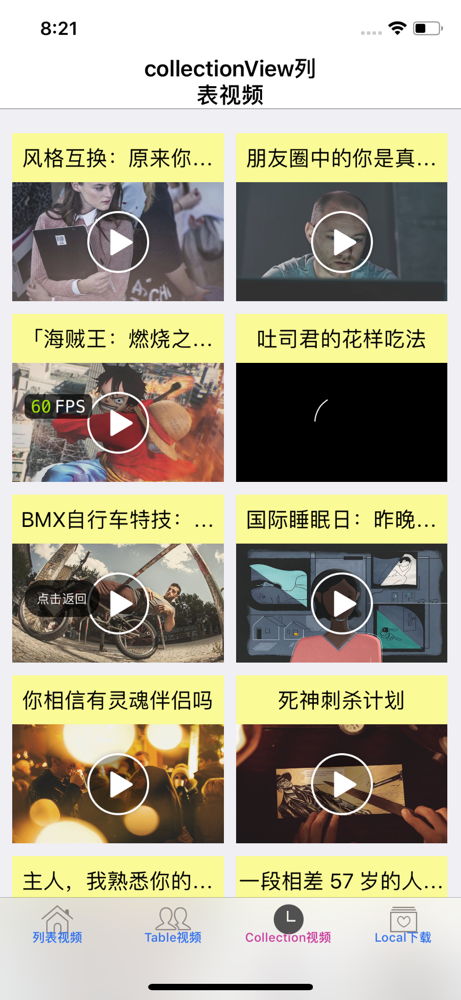

##  iOSProject

- [开始](#Getting_Started)
- [首页功能列表](#homeList)
- [基础知识](#foundation)
 	- [多线程,NSThread,,线程同步,GCD,NSOperation,同步锁](#foundationList02)
   	- [运行时 RunTime, 运行循环 RunLoop](#foundationList01)
	- [绘图,核心动画,物理仿真](#foundationList)
- [分享和第三方登录](#homeBaseShareLogin)
- [Demos 综合案例](#demo_s)
	- [百思不得姐](#bsj)
	- [微博](#wb)
	- [QQ 音乐 music](#qqmusic)
	- [视频播放](#videos)
- [Others 其他](#other_s)
- [期待](#qidai)

##  首页功能列表
|
|

 
 

##  基础知识
|
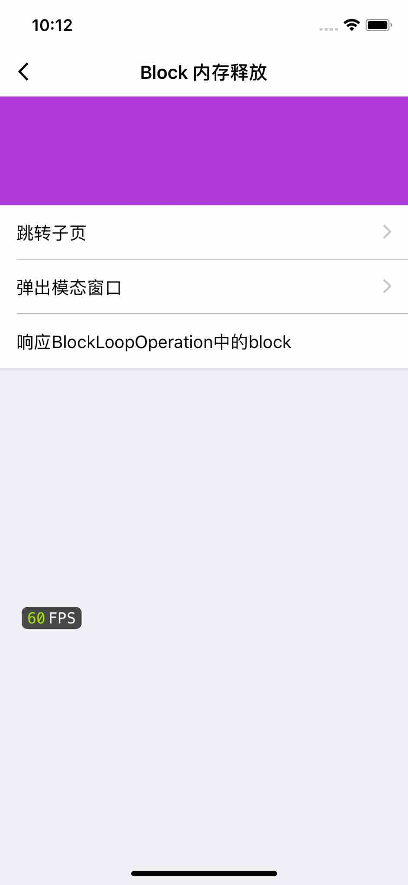
 
 

###  多线程,NSThread,,线程同步,GCD,NSOperation,同步锁
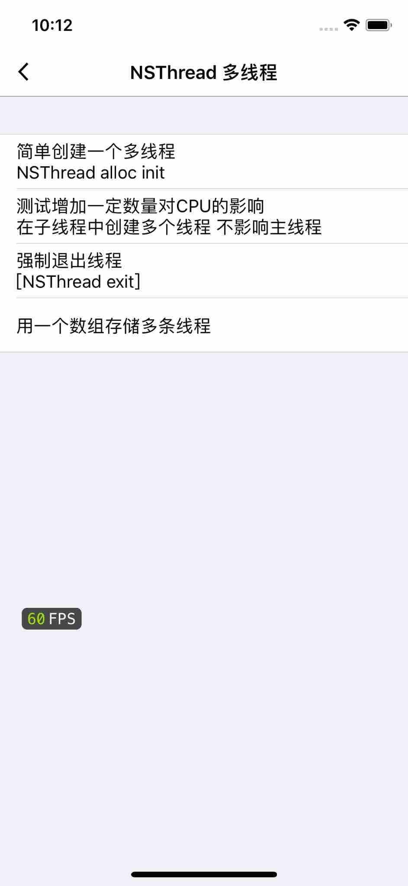
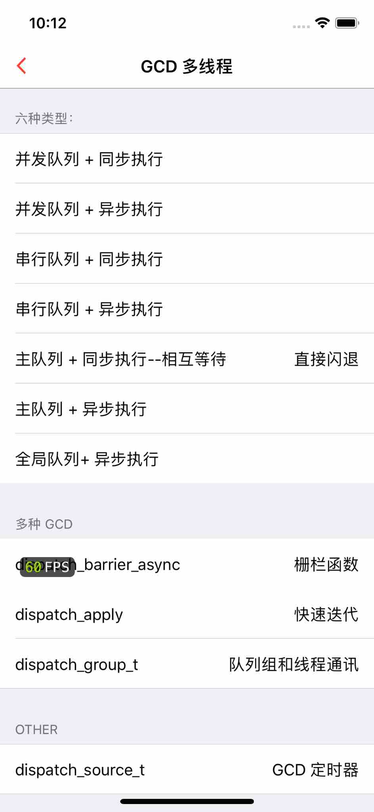
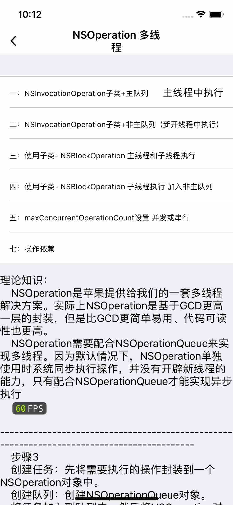
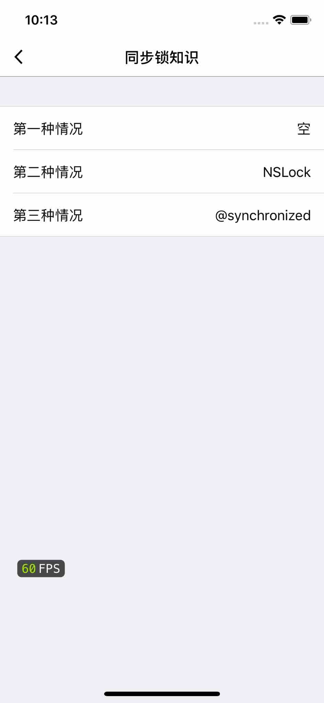
 
 

###  运行时 RunTime, 运行循环 RunLoop
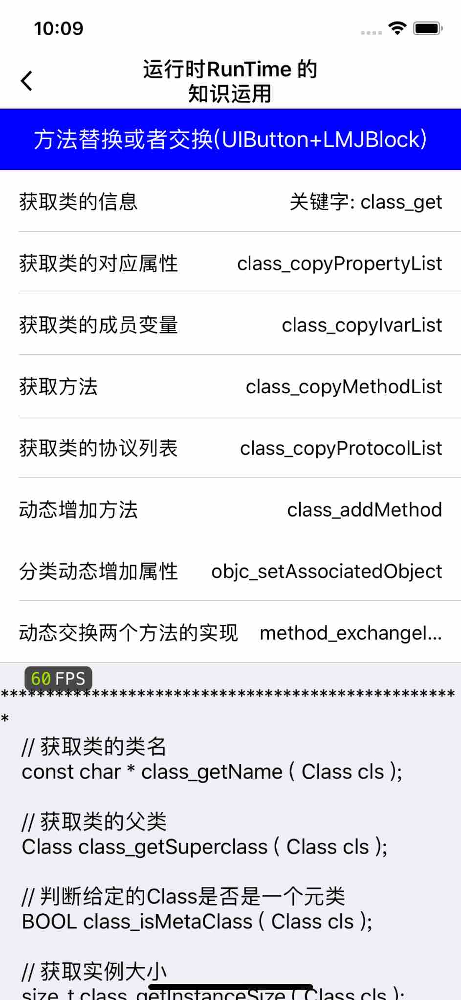|
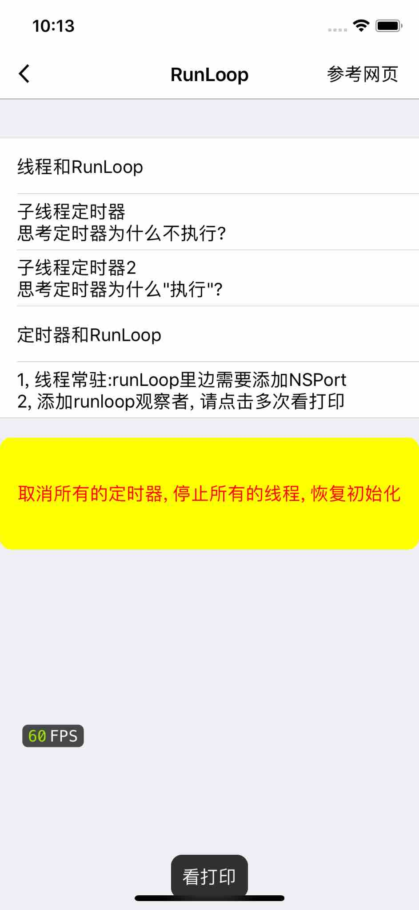
 
 

###  绘图,核心动画,物理仿真
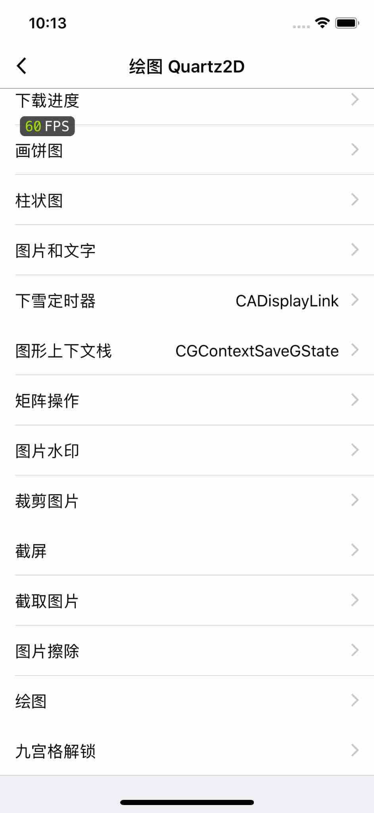|
|
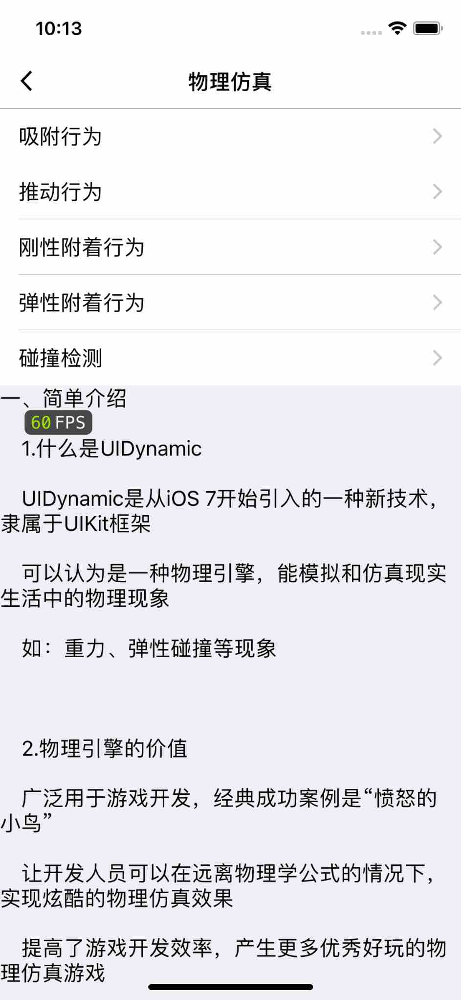
 
 

##  分享和第三方登录
|

 
 
 

##  Demos 综合案例

###  百思不得姐
|
|
|
|
|
|
|
|
|
|
|
|
|
|
|
|

 
 
 
 
 

###  微博
|
|
|
|
|
|
|
|

 
 
 
 
 

###  QQ 音乐 music
|
|

 
 
 
 
 

###  视频播放
|
|
|
|
|
|
|
|

 
 
 
 
 

##  其他
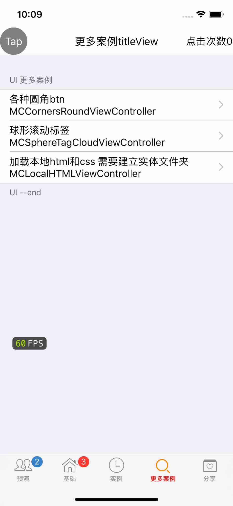|

##  期待
* 如果在使用过程中遇到BUG，希望你能Issues我，谢谢（或者尝试下载最新的Demo代码看看BUG修复没有）
* 如果在使用过程中发现功能不够用，希望你能Issues我，我非常想为这个Demo增加更多好用的功能，谢谢
* 如果你想为iOSProject输出代码，请拼命Pull Requests我
