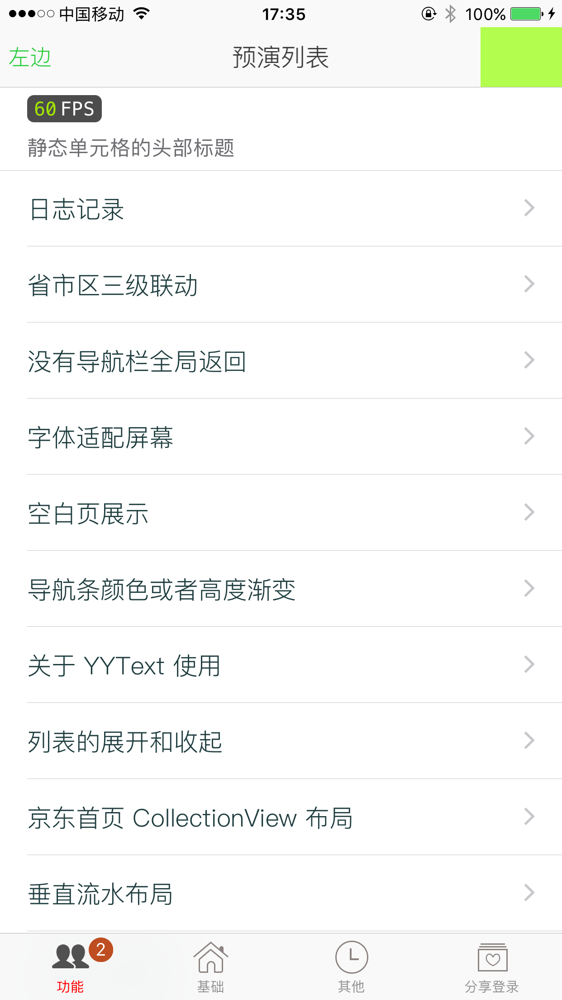
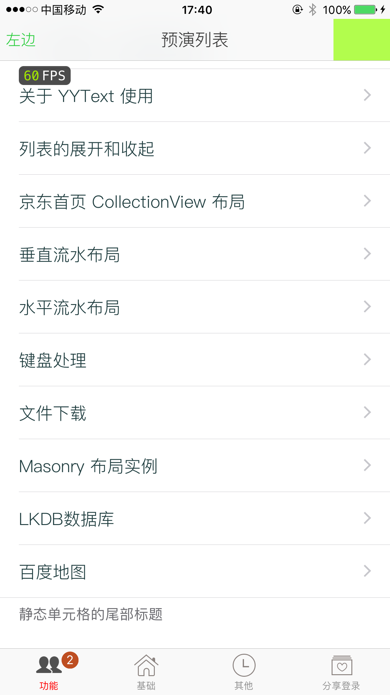
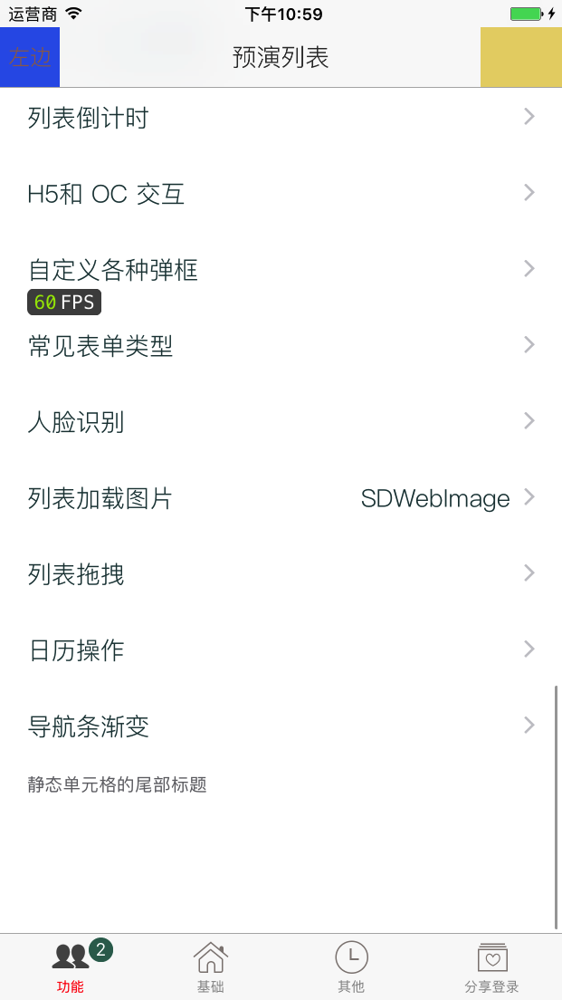

# 各种功能 Demo

- 启动导引, 启动广告

- 导航条自定义, 没有用系统的导航条UI

- 基础知识点

- 友盟第三方登录, 友盟分享, 友盟推送

- 各种功能 demo 

### 感谢作者[wujunyang](https://github.com/wujunyang)在 GitHub 上[MobileProject](https://github.com/wujunyang/MobileProject)开源项目

### [PLMMPrjk](https://github.com/NJHu/PLMMPrjk)开源项目大部分代码直接借鉴[MobileProject](https://github.com/wujunyang/MobileProject)学习.

### 感谢作者[wujunyang](https://github.com/wujunyang)在 GitHub上细心解答.
